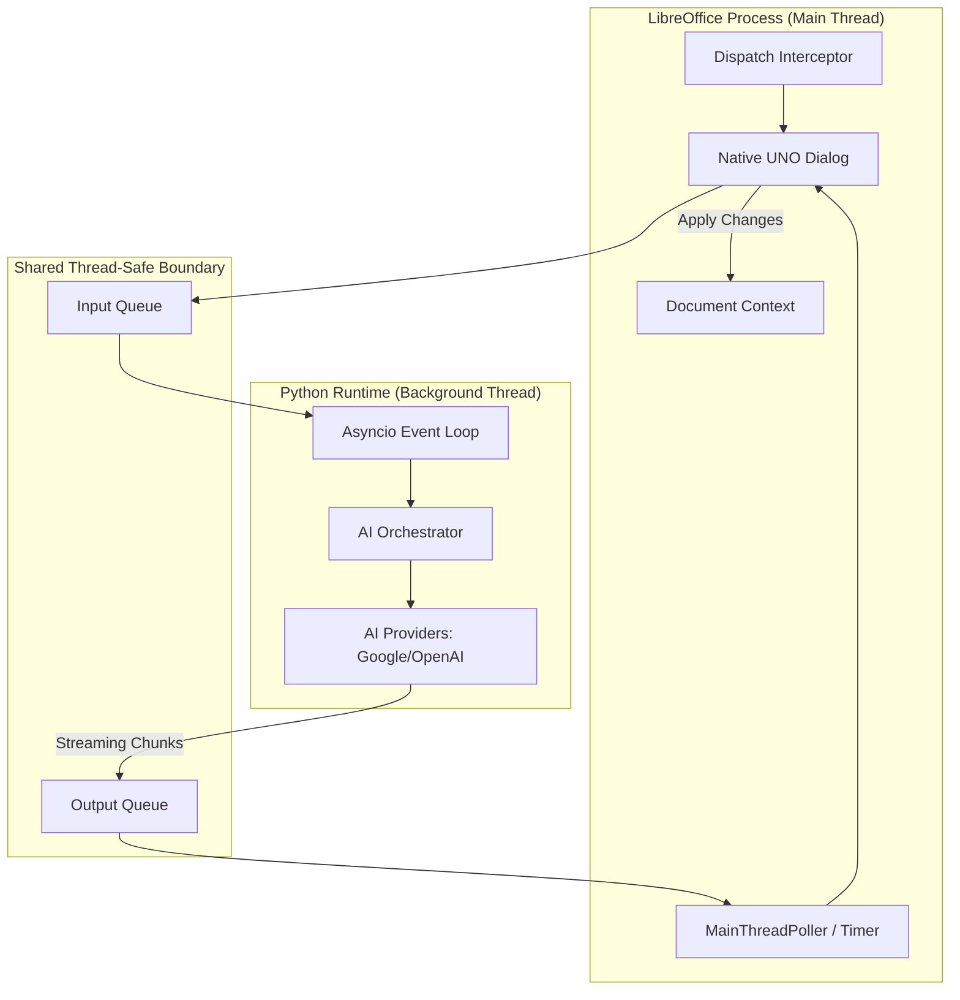
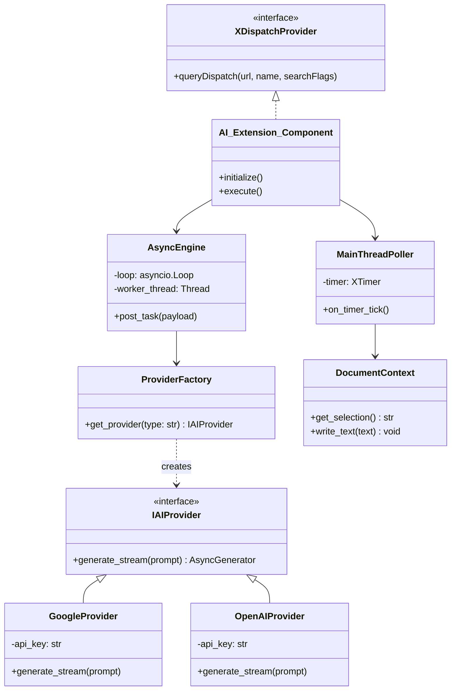
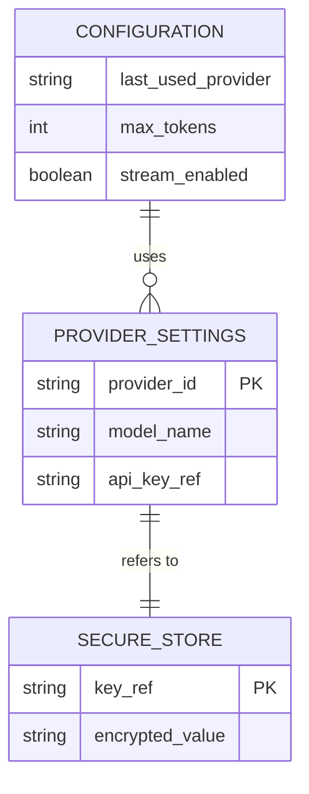

# System Low-Level Design (LLD): AI-Powered LibreOffice Extension

**Role:** System Architect / LLD Designer
**Standards:** SOLID, Design Patterns (Factory, Observer, Bridge), Async Architecture.

---

## 1. System Architecture Diagram
This diagram shows the high-level boundaries between LibreOffice (Main Thread) and the Python Async Engine (Background Thread).



---

## 2. Class Diagram
Detailed breakdown of classes, interfaces, and their relationships.



---

## 3. Sequence Diagram: Asynchronous Streaming Flow
This diagram details how text flows from the user's selection to the AI and back to the dialog without freezing the UI.

```mermaid
sequenceDiagram
    participant User
    participant Dialog as Native UNO Dialog
    participant Main as MainThreadPoller
    participant IQ as Input Queue
    participant Loop as Async Event Loop
    participant AI as AI Provider (SDK)
    participant OQ as Output Queue

    User->>Dialog: Clicks "Generate"
    Dialog->>IQ: Push(Selection + Provider)
    Loop->>IQ: Pop()
    Loop->>AI: generate_stream(prompt)
    
    loop Streaming
        AI-->>Loop: Chunk
        Loop->>OQ: Push(Chunk)
        Main->>OQ: Pop() (Every 100ms)
        Main->>Dialog: Update Textbox
    end

    User->>Dialog: Clicks "Apply"
    Dialog->>User: Text written to document
```

---

## 4. Entity-Relationship (ER) Diagram: Configuration Store
Shows how user preferences and secure keys are managed.



---

## 5. Design Pattern Explanations

### 1. Abstract Factory (ProviderFactory)
Used to decouple the extension from specific AI SDKs. When the user selects "Google" or "OpenAI" in the dialog, the `ProviderFactory` returns an object that implements the `IAIProvider` interface. This allows us to add new models (like Anthropic) in the future without changing the core UI logic.

### 2. Bridge Pattern (AsyncEngine/MainThreadPoller)
Used to bridge the synchronous world of LibreOffice (C++) and the asynchronous world of Python. The `Input/Output Queues` act as the bridge, ensuring neither thread directly accesses the other's internal state, preventing race conditions and crashes.

### 3. Command Pattern (DispatchInterceptor)
The extension implements `XDispatchProvider`, treating user actions (menu clicks) as commands. This allows for a clean separation between the "UI Trigger" and the "Logic Execution."

### 4. SOLID Implementation Details
- **S (SRP):** `DocumentContext` has one job: translation between Python strings and UNO `XText` objects.
- **O (OCP):** New AI Providers can be added by creating a new class implementing `IAIProvider`.
- **D (DIP):** The `NativeUI` depends on the `IAIProvider` abstraction, not on concrete `GoogleSDK` or `OpenAISDK` classes.
